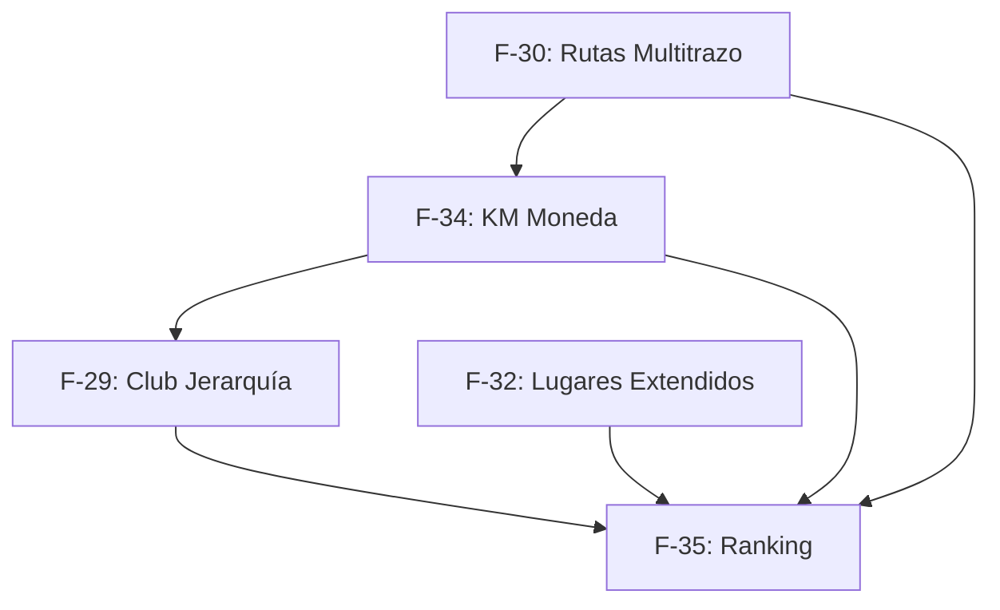

# SDD — Comunidad y Rutas

> **Proyecto:** Moteros / AsfaltoClub  
> **Documento:** Propuesta de Cambio — Comunidad y Rutas (5 features en una entrega cohesiva)  
> **Autor:** Hermes Agent / Nous Research  
> **Fecha:** Julio 2026  
> **Estado:** ✅ Propuesta (Pendiente de aprobación)  
> **Base:** `SUPABASE_MIGRATION_SDD.md`, `SUPABASE_RAIDS_SDD.md`, `SUPABASE_RAIDS_SPECS.md`

---

## 1. TÍTULO Y OBJETIVO

**Comunidad y Rutas — Club jerarquía, rutas multitrazo, lugares de interés extendidos, kilometraje como moneda y ranking nacional**

### Objetivo

Combinar 5 features en un único cambio cohesivo que transforma AsfaltoClub de una app de raids y checkpoints a una **comunidad motera completa con clubes jerárquicos, sistema de kilometraje como moneda de progreso, rutas multitrazo, lugares de interés extendidos y ranking nacional anual**. La entrega toca verticalmente todas las capas: schema SQL, RLS, Flutter BLoCs, screens, widgets y lógica de negocio.

---

## 2. ALCANCE

### ✅ INCLUIDO (5 features + refactors)

| ID | Feature | Descripción |
|----|---------|-------------|
| **F-29** | Club Jerarquía y Roles | Renombrar `clanes` → `clubs`. Nueva tabla `club_ranks`. Roles: Presidente (1), Oficiales (N), Honorables (N), Aspirantes (N). Retos de club. Promociones manuales. |
| **F-30** | Rutas Multitrazo + Motoposadas | Tablas `routes` (waypoints JSONB), `route_segments` (polylines). Motoposadas como waypoints sugeridos. Mapa dual: planned (gray) vs actual (amber/cyan). |
| **F-32** | Lugares de Interés extendidos | Extender `places` con `is_workshop`, `is_hospital`, `is_motoposada`, `is_gas_station`, `is_tourist_spot`. Añadir `created_by`, `club_id`, `visit_count`, `best_photo_url`. Merit points al creador. |
| **F-34** | Kilometraje como Moneda | Tabla `user_mileage`. Auto-track GPS, entrada manual + foto odómetro + verificación admin. Breakdown mensual. Requisito KM para rangos de club. |
| **F-35** | Ranking Nacional + Premio Anual | Rediseño de leaderboard con filtros Nacional / Por club / Por departamento. Periodos: Este mes / Este año / Histórico. Premio Anual con 5 categorías. |

### ♻️ QUÉ SE REUTILIZA / REFACTOREA

| Componente | Acción |
|------------|--------|
| `clans/` → `clubs/` | Renombrar módulo Flutter, tablas SQL existentes `clanes` → `clubs` |
| `clan_ranks` → nuevo | Reemplazar el simple `role` TEXT por sistema de rango con niveles y requisitos |
| `progression/leaderboard_screen.dart` | Rediseño completo con filtros, periodos y columnas extendidas |
| `places/` table + model | Extender con nuevos campos booleanos + contadores |
| `user_xp.km_traveled` → `user_mileage` | Migrar datos de kilometraje a tabla dedicada |
| `map_explorer_screen.dart` | Añadir filtros por tipo extendido + mostrar lugares propios |
| `tracker/route_tracker_screen.dart` | Añadir mapa dual (planned/actual) y multi-waypoint |
| `refugios/motoposadas` | Integrar como waypoints sugeridos en creación de rutas |

### ❌ EXCLUIDO

| Componente | Razón |
|------------|-------|
| Raids multiplayer (F-05–F-09) | Ya implementado en `SUPABASE_RAIDS_SDD.md` |
| Battle Pass / Shop (F-16–F-17) | Excluido de este alcance |
| LiveKit / Voice Chat (F-11) | Excluido |
| SOS / Crash detection (F-14) | Excluido |
| PostGIS / ST_DWithin | Ya migrado a Haversine SQL puro |

---

## 3. ESTRATEGIA DE ENTREGA

### 3.1 Visión general

```
┌──────────────────────────────────────────────────────────────────────┐
│                    COMUNIDAD Y RUTAS (entrega única)                  │
│                                                                      │
│  ┌──────────────┐  ┌──────────────┐  ┌──────────────┐  ┌─────────┐  │
│  │  F-29        │  │  F-30        │  │  F-32        │  │  F-34   │  │
│  │  Club        │  │  Rutas       │  │  Lugares     │  │  KM     │  │
│  │  Jerarquía   │  │  Multitrazo  │  │  Extendidos  │  │  Moneda │  │
│  └──────┬───────┘  └──────┬───────┘  └──────┬───────┘  └────┬────┘  │
│         │                 │                 │               │       │
│         └──────────┬──────┴─────────────────┴───────────────┘       │
│                    │                                                │
│                    ▼                                                │
│  ┌──────────────────────────────────────────────────────────┐      │
│  │  F-35: Ranking Nacional + Premio Anual                   │      │
│  │  Consume datos de clubes, kilometraje, lugares y rutas   │      │
│  └──────────────────────────────────────────────────────────┘      │
│                                                                      │
│  Migración: clanes → clubs (rename)                                 │
└──────────────────────────────────────────────────────────────────────┘
```

### 3.2 Dependencias entre features



**Orden de implementación recomendado:**

1. **F-32** (Lugares extendidos) — más simple, extiende tabla existente sin cambios rotundos
2. **F-29** (Club Jerarquía) — rename + nuevas tablas, backbone social
3. **F-34** (KM Moneda) — nueva tabla que alimenta F-29 y F-35
4. **F-30** (Rutas Multitrazo) — más complejo, consume motoposadas existentes
5. **F-35** (Ranking + Premio Anual) — feature de consumo, último

### 3.3 Migración clanes → clubs

```
Paso 1: CREATE TABLE clubs (like clanes + new columns)
Paso 2: INSERT INTO clubs SELECT * FROM clanes
Paso 3: ALTER TABLE ... RENAME COLUMN/RETURNING (o drop clanes tras migrar FKs)
Paso 4: Actualizar RLS y triggers que referencian clanes
Paso 5: Renombrar módulo Flutter clans/ → clubs/
```

---

## 4. DISEÑO DETALLADO — F-29: CLUB JERARQUÍA Y ROLES

### 4.1 Tablas

```sql
-- ============================================================
-- clubs (reemplaza clanes)
-- ============================================================
CREATE TABLE IF NOT EXISTS clubs (
    id              BIGSERIAL PRIMARY KEY,
    name            VARCHAR(100) NOT NULL UNIQUE,
    tag             VARCHAR(10) NOT NULL UNIQUE,
    description     TEXT,
    logo_url        VARCHAR(550),
    banner_url      VARCHAR(550),
    founder_id      UUID NOT NULL REFERENCES users(id) ON DELETE RESTRICT,
    is_public       BOOLEAN DEFAULT TRUE,
    max_members     INT DEFAULT 50,
    -- Nuevos campos F-29
    total_km        DOUBLE PRECISION DEFAULT 0,
    total_challenges_completed INT DEFAULT 0,
    created_at      TIMESTAMPTZ DEFAULT CURRENT_TIMESTAMP,
    updated_at      TIMESTAMPTZ DEFAULT CURRENT_TIMESTAMP
);

-- ============================================================
-- club_ranks (sistema jerárquico)
-- ============================================================
CREATE TABLE IF NOT EXISTS club_ranks (
    id              BIGSERIAL PRIMARY KEY,
    club_id         BIGINT NOT NULL REFERENCES clubs(id) ON DELETE CASCADE,
    name            VARCHAR(100) NOT NULL,       -- Presidente, Oficial, Honorable, Aspirante
    level           INT NOT NULL CHECK (level >= 0),  -- 0=aspirante, 1=honorable, 2=oficial, 3=presidente
    requirements    JSONB DEFAULT '{}',           -- {"min_km": 500, "min_puntos": 100, "min_challenges": 3}
    max_slots       INT,                          -- NULL = ilimitado (para oficiales), 1 para presidente
    is_leader       BOOLEAN DEFAULT FALSE,        -- TRUE for presidente rank
    created_at      TIMESTAMPTZ DEFAULT CURRENT_TIMESTAMP,
    UNIQUE(club_id, name)
);

-- ============================================================
-- club_members (reemplaza clan_members, con rango expandido)
-- ============================================================
CREATE TABLE IF NOT EXISTS club_members (
    id              BIGSERIAL PRIMARY KEY,
    club_id         BIGINT NOT NULL REFERENCES clubs(id) ON DELETE CASCADE,
    user_id         UUID NOT NULL REFERENCES users(id) ON DELETE CASCADE,
    rank_id         BIGINT REFERENCES club_ranks(id) ON DELETE SET NULL,
    role            TEXT NOT NULL DEFAULT 'aspirante'
                    CHECK (role IN ('presidente', 'oficial', 'honorable', 'aspirante')),
    joined_at       TIMESTAMPTZ DEFAULT CURRENT_TIMESTAMP,
    promoted_at     TIMESTAMPTZ,                  -- última promoción
    promoted_by     UUID REFERENCES users(id) ON DELETE SET NULL,
    UNIQUE(club_id, user_id)
);

-- ============================================================
-- club_challenges (retos creados por el presidente)
-- ============================================================
CREATE TABLE IF NOT EXISTS club_challenges (
    id              BIGSERIAL PRIMARY KEY,
    club_id         BIGINT NOT NULL REFERENCES clubs(id) ON DELETE CASCADE,
    created_by      UUID NOT NULL REFERENCES users(id) ON DELETE CASCADE,
    title           VARCHAR(255) NOT NULL,
    description     TEXT,
    type            TEXT NOT NULL
                    CHECK (type IN ('km', 'puntos', 'lugares', 'raids', 'rutas')),
    target_value    DOUBLE PRECISION NOT NULL,     -- ej: 500 km, 10 lugares
    duration_days   INT DEFAULT 30,
    reward_xp       INT DEFAULT 0,
    reward_rank_id  BIGINT REFERENCES club_ranks(id) ON DELETE SET NULL,
    is_active       BOOLEAN DEFAULT TRUE,
    starts_at       TIMESTAMPTZ DEFAULT CURRENT_TIMESTAMP,
    ends_at         TIMESTAMPTZ,
    created_at      TIMESTAMPTZ DEFAULT CURRENT_TIMESTAMP
);

-- ============================================================
-- club_challenge_progress
-- ============================================================
CREATE TABLE IF NOT EXISTS club_challenge_progress (
    id              BIGSERIAL PRIMARY KEY,
    challenge_id    BIGINT NOT NULL REFERENCES club_challenges(id) ON DELETE CASCADE,
    user_id         UUID NOT NULL REFERENCES users(id) ON DELETE CASCADE,
    current_value   DOUBLE PRECISION DEFAULT 0,
    completed       BOOLEAN DEFAULT FALSE,
    completed_at    TIMESTAMPTZ,
    UNIQUE(challenge_id, user_id)
);
```

### 4.2 Lógica de negocio

**Reglas de jerarquía:**

| Rol | Cantidad | Puede invitar | Puede promover | Puede crear retos | Puede expulsar | Puede editar club |
|-----|----------|:---:|:---:|:---:|:---:|:---:|
| Presidente | 1 | ✅ | ✅ (a oficial) | ✅ | ✅ | ✅ |
| Oficial | N | ✅ | ✅ (solo a honorable/aspirante) | ❌ | ✅ (solo aspirantes) | ❌ |
| Honorable | N | ✅ | ❌ | ❌ | ❌ | ❌ |
| Aspirante | N | ❌ | ❌ | ❌ | ❌ | ❌ |

**Promoción automática (trigger-based):**
- Cuando un miembro cumple los `requirements` de un rank en `club_ranks`, se marca como elegible
- El presidente/oficial debe aprobar la promoción manualmente
- Edge Function `check_rank_eligibility` se ejecuta al actualizar `user_mileage`, `user_xp`, `club_challenge_progress`

### 4.3 Flutter cambios

```
lib/features/clubs/                        # Renombrado de clans/
├── data/
│   ├── datasources/
│   │   └── club_remote_datasource.dart    # Nuevo
│   └── models/
│       ├── club_model.dart                # Refactor
│       ├── club_rank_model.dart           # Nuevo
│       ├── club_member_model.dart         # Refactor
│       └── club_challenge_model.dart      # Nuevo
├── domain/
│   ├── entities/
│   │   ├── club_entity.dart
│   │   ├── club_rank_entity.dart
│   │   ├── club_member_entity.dart
│   │   └── club_challenge_entity.dart
│   └── usecases/
│       ├── promote_member.dart
│       ├── create_club_challenge.dart
│       └── check_rank_eligibility.dart
└── presentation/
    ├── bloc/
    │   ├── club_bloc.dart                 # Extendido
    │   ├── club_event.dart                # +PromoteMember, +CreateChallenge, etc.
    │   └── club_state.dart                # +RankManagement, +ChallengeProgress
    └── screens/
        ├── club_list_screen.dart
        ├── club_screen.dart               # Rediseño con sección de rangos
        ├── club_members_screen.dart       # Rediseño con columna de rango
        ├── create_club_screen.dart
        ├── club_rank_management_screen.dart  # Nuevo
        └── club_challenge_create_screen.dart # Nuevo
```

### 4.4 Anti-fraud / Safe coding

| Riesgo | Mitigación |
|--------|-----------|
| Presidente se auto-remueve | RLS impide: `CHECK (NOT (role = 'presidente' AND user_id = auth.uid() AND NEW.role != 'presidente'))` |
| Dos presidentes | Trigger BEFORE INSERT/UPDATE en club_members: si ya hay presidente, rechazar |
| Promoción sin requisitos | Validación en Edge Function `promote_member` que verifica requirements JSONB |
| Expulsar al presidente | CHECK en aplicación: solo `oficial` puede expulsar, y solo a `aspirante` |

---

## 5. DISEÑO DETALLADO — F-30: RUTAS MULTITRAZO + MOTOPOSADAS

### 5.1 Tablas

```sql
-- ============================================================
-- routes (multitrazo: A → B → C → D)
-- ============================================================
CREATE TABLE IF NOT EXISTS routes (
    id              BIGSERIAL PRIMARY KEY,
    created_by      UUID NOT NULL REFERENCES users(id) ON DELETE CASCADE,
    club_id         BIGINT REFERENCES clubs(id) ON DELETE SET NULL,
    title           VARCHAR(255) NOT NULL,
    description     TEXT,
    -- Waypoints as ordered array [{lat, lng, name, stop_type, duration_min}]
    waypoints       JSONB NOT NULL DEFAULT '[]',
    total_km        DOUBLE PRECISION DEFAULT 0,
    est_duration_min INT DEFAULT 0,              -- estimated riding time
    difficulty      TEXT CHECK (difficulty IN ('facil', 'medio', 'dificil', 'experto')),
    is_public       BOOLEAN DEFAULT TRUE,
    tags            TEXT[] DEFAULT '{}',
    cover_image_url VARCHAR(550),
    completion_count INT DEFAULT 0,
    avg_rating      DOUBLE PRECISION DEFAULT 0 CHECK (avg_rating BETWEEN 0 AND 5),
    created_at      TIMESTAMPTZ DEFAULT CURRENT_TIMESTAMP,
    updated_at      TIMESTAMPTZ DEFAULT CURRENT_TIMESTAMP
);

CREATE INDEX IF NOT EXISTS idx_routes_creator ON routes(created_by);
CREATE INDEX IF NOT EXISTS idx_routes_club ON routes(club_id) WHERE club_id IS NOT NULL;
CREATE INDEX IF NOT EXISTS idx_routes_public ON routes(is_public) WHERE is_public = TRUE;
CREATE INDEX IF NOT EXISTS idx_routes_difficulty ON routes(difficulty);
-- GIN index for tags array queries
CREATE INDEX IF NOT EXISTS idx_routes_tags ON routes USING GIN(tags);

-- ============================================================
-- route_segments (cada tramo entre waypoints)
-- ============================================================
CREATE TABLE IF NOT EXISTS route_segments (
    id              BIGSERIAL PRIMARY KEY,
    route_id        BIGINT NOT NULL REFERENCES routes(id) ON DELETE CASCADE,
    segment_order   INT NOT NULL,
    from_waypoint_index INT NOT NULL,            -- índice en waypoints[]
    to_waypoint_index   INT NOT NULL,
    segment_km      DOUBLE PRECISION DEFAULT 0,
    est_duration_min INT DEFAULT 0,
    -- Polyline for map display (simplified GeoJSON-like or encoded polyline)
    polyline        JSONB NOT NULL DEFAULT '[]',  -- [{lat, lng}...]
    road_type       TEXT CHECK (road_type IN ('pavimentada', 'ripio', 'mixta', 'desconocida')),
    created_at      TIMESTAMPTZ DEFAULT CURRENT_TIMESTAMP,
    UNIQUE(route_id, segment_order)
);

CREATE INDEX IF NOT EXISTS idx_route_segments_route ON route_segments(route_id, segment_order);

-- ============================================================
-- route_history (completions by users)
-- ============================================================
CREATE TABLE IF NOT EXISTS route_history (
    id              BIGSERIAL PRIMARY KEY,
    route_id        BIGINT NOT NULL REFERENCES routes(id) ON DELETE CASCADE,
    user_id         UUID NOT NULL REFERENCES users(id) ON DELETE CASCADE,
    started_at      TIMESTAMPTZ NOT NULL,
    completed_at    TIMESTAMPTZ NOT NULL,
    actual_km       DOUBLE PRECISION DEFAULT 0,
    actual_duration_min INT DEFAULT 0,
    -- The actual GPS trace (amber/cyan line on map)
    trace_polyline  JSONB DEFAULT '[]',
    deviation_km    DOUBLE PRECISION DEFAULT 0,  -- difference planned vs actual
    rating          SMALLINT CHECK (rating BETWEEN 1 AND 5),
    notes           TEXT,
    created_at      TIMESTAMPTZ DEFAULT CURRENT_TIMESTAMP,
    UNIQUE(route_id, user_id, completed_at)
);

CREATE INDEX IF NOT EXISTS idx_route_history_route ON route_history(route_id);
CREATE INDEX IF NOT EXISTS idx_route_history_user ON route_history(user_id);
CREATE INDEX IF NOT EXISTS idx_route_history_completed ON route_history(completed_at);
```

### 5.2 Datos de motoposadas en sugerencia de ruta

Cuando un usuario crea una ruta, el sistema sugiere motoposadas cercanas a los waypoints:

```sql
-- Función para obtener motoposadas sugeridas a lo largo de una ruta
CREATE OR REPLACE FUNCTION suggest_motoposadas_for_route(
    p_waypoints JSONB,              -- el waypoints[] de la ruta
    p_max_distance_km DOUBLE PRECISION DEFAULT 20
) RETURNS TABLE(
    motoposada_id BIGINT,
    title VARCHAR,
    lat DOUBLE PRECISION,
    lng DOUBLE PRECISION,
    waypoint_index INT,
    distance_km DOUBLE PRECISION
)
LANGUAGE sql STABLE
AS $$
    -- Para cada waypoint, busca motoposadas activas dentro del radio
    SELECT
        m.id,
        m.title,
        m.lat,
        m.lng,
        wp.idx::INT,
        haversine_distance(
            (wp.value->>'lat')::DOUBLE PRECISION,
            (wp.value->>'lng')::DOUBLE PRECISION,
            m.lat, m.lng
        ) / 1000.0
    FROM motoposadas m
    CROSS JOIN LATERAL jsonb_array_elements(p_waypoints) WITH ORDINALITY AS wp(value, idx)
    WHERE m.is_active = TRUE
      AND haversine_distance(
            (wp.value->>'lat')::DOUBLE PRECISION,
            (wp.value->>'lng')::DOUBLE PRECISION,
            m.lat, m.lng
          ) <= p_max_distance_km * 1000
    ORDER BY wp.idx, distance_km;
$$;
```

### 5.3 Mapa dual (planned vs actual)

```
┌─────────────────────────────────────────────┐
│  RUTA: Curva de la Muerte → Villa de Leyva   │
│                                              │
│  ═══════════════ Planned (gray, 40% alpha)   │
│  ━━━━━━━━━━━━━━━ Actual (amber #FF8C00)      │
│  • Waypoints (numbered markers, white)        │
│  ⬤ Motoposadas sugeridas (cyan pulse)        │
│                                              │
│  [Filters: [Planned] [Actual] [Both]]        │
└─────────────────────────────────────────────┘
```

**Implementación en Flutter:**
- Polylines separadas en `flutter_map` con diferentes colores y opacidades
- Planned: `Color(0xFF606070).withAlpha(100)` — gris tenue
- Actual: `Color(0xFFFF8C00)` — ámbar primario (o cyan `#00D4FF` si es nocturna)
- MarkerLayer con iconos numerados para cada waypoint
- Las motoposadas cercanas aparecen con icono pulsante (cyan glow)

### 5.4 Anti-fraud

| Riesgo | Mitigación |
|--------|-----------|
| Ruta falsa (waypoints inventados) | La validación real es el `route_history` con GPS trace — el planned es solo referencia |
| Deviation excesiva | `deviation_km` se calcula en Edge Function al completar, visible en perfil |
| Plagio de rutas | `created_by` + copyright implícito, sin enforcement legal |
| Spam de rutas | Rate limiting en Edge Function: max 5 rutas/día por usuario |

---

## 6. DISEÑO DETALLADO — F-32: LUGARES DE INTERÉS EXTENDIDOS

### 6.1 Migración de tabla places (ALTER TABLE)

```sql
-- ============================================================
-- Extensión de places (F-32)
-- ============================================================
ALTER TABLE places ADD COLUMN IF NOT EXISTS is_workshop       BOOLEAN DEFAULT FALSE;
ALTER TABLE places ADD COLUMN IF NOT EXISTS is_hospital       BOOLEAN DEFAULT FALSE;
ALTER TABLE places ADD COLUMN IF NOT EXISTS is_motoposada     BOOLEAN DEFAULT FALSE;
ALTER TABLE places ADD COLUMN IF NOT EXISTS is_gas_station    BOOLEAN DEFAULT FALSE;
ALTER TABLE places ADD COLUMN IF NOT EXISTS is_tourist_spot   BOOLEAN DEFAULT FALSE;
ALTER TABLE places ADD COLUMN IF NOT EXISTS club_id           BIGINT REFERENCES clubs(id) ON DELETE SET NULL;
ALTER TABLE places ADD COLUMN IF NOT EXISTS visit_count       INT DEFAULT 0;
ALTER TABLE places ADD COLUMN IF NOT EXISTS best_photo_url    VARCHAR(550);
ALTER TABLE places ADD COLUMN IF NOT EXISTS phone             VARCHAR(50);
ALTER TABLE places ADD COLUMN IF NOT EXISTS website           VARCHAR(255);
ALTER TABLE places ADD COLUMN IF NOT EXISTS opening_hours     TEXT;
ALTER TABLE places ADD COLUMN IF NOT EXISTS is_verified       BOOLEAN DEFAULT FALSE;
ALTER TABLE places ADD COLUMN IF NOT EXISTS verified_at       TIMESTAMPTZ;
ALTER TABLE places ADD COLUMN IF NOT EXISTS verified_by       UUID REFERENCES users(id) ON DELETE SET NULL;

-- Constraints: al menos un tipo debe ser TRUE
ALTER TABLE places ADD CONSTRAINT chk_place_type CHECK (
    is_workshop OR is_hospital OR is_motoposada OR is_gas_station OR is_tourist_spot
);

-- Index for type-based filtering
CREATE INDEX IF NOT EXISTS idx_places_types ON places(is_workshop, is_hospital, is_motoposada, is_gas_station, is_tourist_spot);
```

### 6.2 Trigger: visit_count + merit points

```sql
-- ============================================================
-- Al registrar una visita, incrementar visit_count y dar puntos al creador
-- ============================================================
CREATE OR REPLACE FUNCTION handle_place_visit()
RETURNS TRIGGER
LANGUAGE plpgsql SECURITY DEFINER
AS $$
BEGIN
    -- Increment visit_count
    UPDATE places SET visit_count = visit_count + 1 WHERE id = NEW.place_id;

    -- Award merit points to place creator (5 XP per visit)
    UPDATE user_xp
    SET total_xp = total_xp + 5
    WHERE user_id = (SELECT created_by FROM places WHERE id = NEW.place_id)
      AND (SELECT created_by FROM places WHERE id = NEW.place_id) IS NOT NULL;

    RETURN NEW;
END;
$$;

CREATE TRIGGER trg_place_visit
    AFTER INSERT ON visits
    FOR EACH ROW
    EXECUTE FUNCTION handle_place_visit();
```

### 6.3 Modelo Flutter extendido

```dart
class PlaceModel {
  // ... campos existentes ...
  
  // F-32 nuevos campos
  final bool isWorkshop;
  final bool isHospital;
  final bool isMotoposada;
  final bool isGasStation;
  final bool isTouristSpot;
  final int? clubId;
  final int visitCount;
  final String? bestPhotoUrl;
  final String? phone;
  final String? website;
  final String? openingHours;
  final bool isVerified;

  // Tipo principal para UI (derivado)
  String get primaryType {
    if (isWorkshop) return 'taller';
    if (isHospital) return 'hospital';
    if (isMotoposada) return 'moto_posada';
    if (isGasStation) return 'gas_station';
    if (isTouristSpot) return 'tourist_spot';
    return category; // fallback legacy
  }
}
```

### 6.4 Nuevos filtros en MapExplorerScreen

```
FILTERS: [Todos] [🛠 Taller] [🏥 Hospital] [🏠 Moto Posada] [⛽ Gas] [📍 Turístico]
```

---

## 7. DISEÑO DETALLADO — F-34: KILOMETRAJE COMO MONEDA

### 7.1 Tablas

```sql
-- ============================================================
-- user_mileage (kilometraje como moneda)
-- ============================================================
CREATE TABLE IF NOT EXISTS user_mileage (
    id                  BIGSERIAL PRIMARY KEY,
    user_id             UUID NOT NULL REFERENCES users(id) ON DELETE CASCADE UNIQUE,
    total_km            DOUBLE PRECISION DEFAULT 0,       -- suma de todos los orígenes
    verified_km         DOUBLE PRECISION DEFAULT 0,       -- de GPS (raids, rutas)
    manual_km           DOUBLE PRECISION DEFAULT 0,       -- ingresado manualmente
    imported_km         DOUBLE PRECISION DEFAULT 0,       -- importado de OSM/external
    -- Breakdown mensual: {"2026-01": 234.5, "2026-02": 567.1}
    mileage_by_month    JSONB DEFAULT '{}',
    last_updated_at     TIMESTAMPTZ DEFAULT CURRENT_TIMESTAMP,
    updated_at          TIMESTAMPTZ DEFAULT CURRENT_TIMESTAMP
);

-- ============================================================
-- mileage_manual_entries (con foto de odómetro)
-- ============================================================
CREATE TABLE IF NOT EXISTS mileage_manual_entries (
    id                  BIGSERIAL PRIMARY KEY,
    user_id             UUID NOT NULL REFERENCES users(id) ON DELETE CASCADE,
    amount_km           DOUBLE PRECISION NOT NULL CHECK (amount_km > 0),
    -- Foto del odómetro (requerida para verificación)
    odometer_photo_url  VARCHAR(550) NOT NULL,
    -- GPS location where photo was taken
    photo_lat           DOUBLE PRECISION,
    photo_lng           DOUBLE PRECISION,
    -- Admin verification
    is_verified         BOOLEAN DEFAULT FALSE,
    verified_by         UUID REFERENCES users(id) ON DELETE SET NULL,
    verified_at         TIMESTAMPTZ,
    -- Rejection reason if denied
    rejection_reason    TEXT,
    notes               TEXT,
    created_at          TIMESTAMPTZ DEFAULT CURRENT_TIMESTAMP
);

CREATE INDEX IF NOT EXISTS idx_mileage_manual_user ON mileage_manual_entries(user_id);
CREATE INDEX IF NOT EXISTS idx_mileage_manual_verified ON mileage_manual_entries(is_verified) WHERE is_verified = FALSE;

-- ============================================================
-- mileage_verification_queue (admin dashboard)
-- ============================================================
CREATE VIEW mileage_pending_verification AS
SELECT
    m.id,
    m.user_id,
    u.username,
    u.full_name,
    m.amount_km,
    m.odometer_photo_url,
    m.photo_lat,
    m.photo_lng,
    m.created_at
FROM mileage_manual_entries m
JOIN users u ON u.id = m.user_id
WHERE m.is_verified = FALSE
ORDER BY m.created_at ASC;
```

### 7.2 Trigger: actualizar user_mileage desde diversas fuentes

```sql
-- ============================================================
-- Al completar una ruta (route_history), actualizar kilometraje
-- ============================================================
CREATE OR REPLACE FUNCTION update_mileage_from_route()
RETURNS TRIGGER
LANGUAGE plpgsql SECURITY DEFINER
AS $$
DECLARE
    v_month_key TEXT;
BEGIN
    v_month_key := to_char(NEW.completed_at, 'YYYY-MM');

    INSERT INTO user_mileage (user_id, total_km, verified_km, mileage_by_month)
    VALUES (
        NEW.user_id,
        NEW.actual_km,
        NEW.actual_km,
        jsonb_build_object(v_month_key, NEW.actual_km)
    )
    ON CONFLICT (user_id) DO UPDATE SET
        total_km = user_mileage.total_km + NEW.actual_km,
        verified_km = user_mileage.verified_km + NEW.actual_km,
        mileage_by_month = jsonb_set(
            COALESCE(user_mileage.mileage_by_month, '{}'),
            ARRAY[v_month_key],
            to_jsonb(COALESCE(
                (user_mileage.mileage_by_month->>v_month_key)::DOUBLE PRECISION,
                0
            ) + NEW.actual_km)
        ),
        updated_at = NOW();

    RETURN NEW;
END;
$$;

CREATE TRIGGER trg_mileage_from_route
    AFTER INSERT ON route_history
    FOR EACH ROW
    EXECUTE FUNCTION update_mileage_from_route();

-- ============================================================
-- Al verificar entrada manual, actualizar user_mileage
-- ============================================================
CREATE OR REPLACE FUNCTION update_mileage_from_manual()
RETURNS TRIGGER
LANGUAGE plpgsql SECURITY DEFINER
AS $$
DECLARE
    v_month_key TEXT;
BEGIN
    IF NEW.is_verified = TRUE AND (OLD.is_verified = FALSE OR OLD IS NULL) THEN
        v_month_key := to_char(NEW.verified_at, 'YYYY-MM');

        INSERT INTO user_mileage (user_id, total_km, manual_km, mileage_by_month)
        VALUES (
            NEW.user_id,
            NEW.amount_km,
            NEW.amount_km,
            jsonb_build_object(v_month_key, NEW.amount_km)
        )
        ON CONFLICT (user_id) DO UPDATE SET
            total_km = user_mileage.total_km + NEW.amount_km,
            manual_km = user_mileage.manual_km + NEW.amount_km,
            mileage_by_month = jsonb_set(
                COALESCE(user_mileage.mileage_by_month, '{}'),
                ARRAY[v_month_key],
                to_jsonb(COALESCE(
                    (user_mileage.mileage_by_month->>v_month_key)::DOUBLE PRECISION,
                    0
                ) + NEW.amount_km)
            ),
            updated_at = NOW();
    END IF;
    RETURN NEW;
END;
$$;

CREATE TRIGGER trg_mileage_from_manual
    AFTER UPDATE OF is_verified ON mileage_manual_entries
    FOR EACH ROW
    WHEN (NEW.is_verified = TRUE)
    EXECUTE FUNCTION update_mileage_from_manual();
```

### 7.3 Flutter: kilometraje en perfil

```
┌─────────────────────────────────────┐
│  MI KILOMETRAJE                     │
│                                     │
│  ┌─────────────────────────────────┐│
│  │  12,847 km total                ││
│  │  ─────────────────────           ││
│  │  11,230 km GPS (raids/rutas)    ││
│  │  1,617 km manual                ││
│  │  0 km importado                 ││
│  └─────────────────────────────────┘│
│                                     │
│  Kilometraje por mes                │
│  ┌──┬──┬──┬──┬──┬──┬──┬──┬──┬──┐  │
│  │██│██│█ │██│███│█ │██│█ │  │  │  │
│  │E │F │M │A │M │J │J │A │S │O │  │
│  └──┴──┴──┴──┴──┴──┴──┴──┴──┴──┘  │
│                                     │
│  [AGREGAR KILOMETRAJE MANUAL]       │
└─────────────────────────────────────┘
```

### 7.4 Anti-fraud para manual entries

| Riesgo | Mitigación |
|--------|-----------|
| Foto de odómetro falsa | Verificación manual por admin + AI EXIF check (fecha/hora/GPS de la foto debe coincidir con `photo_lat`/`photo_lng`) |
| Doble contabilidad | UNIQUE(user_id, created_at::date) — 1 entrada manual por día |
| KM inflados | Topes: max 1000 km/entrada manual, max 3 entradas/semana |
| GPS spoofing | `anti_cheat_service.dart` existente verifica plausibilidad (velocidad, aceleración entre puntos) |

---

## 8. DISEÑO DETALLADO — F-35: RANKING NACIONAL + PREMIO ANUAL

### 8.1 Rediseño de leaderboard

**Nuevo modelo de datos:**

```sql
-- ============================================================
-- leaderboard_entries (reemplaza la vista ad-hoc)
-- ============================================================
CREATE TABLE IF NOT EXISTS leaderboard_entries (
    id              BIGSERIAL PRIMARY KEY,
    period          TEXT NOT NULL
                    CHECK (period IN ('monthly', 'yearly', 'historical')),
    scope           TEXT NOT NULL
                    CHECK (scope IN ('nacional', 'club', 'departamento')),
    scope_id        BIGINT,                        -- club_id o departamento code
    user_id         UUID NOT NULL REFERENCES users(id) ON DELETE CASCADE,
    rank            INT NOT NULL,
    total_puntos    INT DEFAULT 0,                  -- XP total del periodo
    total_km        DOUBLE PRECISION DEFAULT 0,    -- km del periodo
    total_destinos  INT DEFAULT 0,                 -- lugares únicos visitados
    total_insignias INT DEFAULT 0,                 -- patches/achievements earned
    club_id         BIGINT REFERENCES clubs(id) ON DELETE SET NULL,
    snapshot_date   DATE NOT NULL DEFAULT CURRENT_DATE,
    created_at      TIMESTAMPTZ DEFAULT CURRENT_TIMESTAMP,
    UNIQUE(period, scope, COALESCE(scope_id, 0), rank, snapshot_date)
);

CREATE INDEX IF NOT EXISTS idx_lb_period_scope ON leaderboard_entries(period, scope, snapshot_date DESC);
CREATE INDEX IF NOT EXISTS idx_lb_user_period ON leaderboard_entries(user_id, period);
```

### 8.2 Materialized view para premio anual

```sql
-- ============================================================
-- premio_anual_candidates (vista para cálculo de nominados)
-- ============================================================
CREATE OR REPLACE VIEW premio_anual_candidates AS
SELECT
    'most_km' AS category,
    u.id AS user_id,
    u.username,
    um.total_km AS metric_value,
    c.name AS club_name
FROM users u
JOIN user_mileage um ON um.user_id = u.id
LEFT JOIN club_members cm ON cm.user_id = u.id AND cm.role = 'presidente'
LEFT JOIN clubs c ON c.id = cm.club_id
WHERE um.total_km > 0
ORDER BY um.total_km DESC
LIMIT 10

UNION ALL

SELECT
    'most_places' AS category,
    u.id,
    u.username,
    COUNT(DISTINCT v.place_id)::INT AS metric_value,
    c.name
FROM users u
JOIN visits v ON v.user_id = u.id
LEFT JOIN club_members cm ON cm.user_id = u.id AND cm.role = 'presidente'
LEFT JOIN clubs c ON c.id = cm.club_id
GROUP BY u.id, u.username, c.name
ORDER BY metric_value DESC
LIMIT 10

UNION ALL

SELECT
    'best_presidente' AS category,
    u.id,
    u.username,
    COALESCE(c.total_challenges_completed + c.total_km::INT / 100, 0) AS metric_value,
    c.name
FROM users u
JOIN club_members cm ON cm.user_id = u.id AND cm.role = 'presidente'
JOIN clubs c ON c.id = cm.club_id
ORDER BY metric_value DESC
LIMIT 10

UNION ALL

SELECT
    'most_challenges' AS category,
    u.id,
    u.username,
    cc.completed_count::INT AS metric_value,
    c.name
FROM users u
LEFT JOIN (
    SELECT user_id, COUNT(*) AS completed_count
    FROM club_challenge_progress
    WHERE completed = TRUE
    GROUP BY user_id
) cc ON cc.user_id = u.id
LEFT JOIN club_members cm ON cm.user_id = u.id AND cm.role = 'presidente'
LEFT JOIN clubs c ON c.id = cm.club_id
ORDER BY metric_value DESC
LIMIT 10

UNION ALL

SELECT
    'best_rookie' AS category,
    u.id,
    u.username,
    ux.total_xp AS metric_value,
    c.name
FROM users u
JOIN user_xp ux ON ux.user_id = u.id
LEFT JOIN club_members cm ON cm.user_id = u.id AND cm.role = 'presidente'
LEFT JOIN clubs c ON c.id = cm.club_id
WHERE u.created_at >= DATE_TRUNC('year', CURRENT_DATE)    -- registrado este año
ORDER BY ux.total_xp DESC
LIMIT 10;
```

### 8.3 UI Redesign

```
┌─────────────────────────────────────────────┐
│  🏆 RANKING NACIONAL                         │
│                                              │
│  ┌──────────────────────────────────────────┐│
│  │  [Nacional ▼]  [Este mes ▼]             ││
│  └──────────────────────────────────────────┘│
│                                              │
│  ┌──────────────────────────────────────────┐│
│  │  # │ Motero     │ Club  │ Dest.│ Ptos│ KM││
│  ├──────────────────────────────────────────┤│
│  │ 1🏅│ RiderX     │ Águilas│  12  │ 2.4k│890││
│  │ 2🥈│ GhostRider │ —      │   8  │ 1.8k│670││
│  │ 3🥉│ TurboBike  │ Halcón │  10  │ 1.5k│520││
│  │ ...│            │        │      │     │   ││
│  └──────────────────────────────────────────┘│
│                                              │
│  ─── PREMIO ANUAL 2026 ───                   │
│  [🏍 Más KM] [📍 Más Lugares]                │
│  [👑 Mejor Presidente] [🏁 Retos] [🌟 Rookie]│
└─────────────────────────────────────────────┘
```

### 8.4 Filtros y periodos

| Filtro | Opciones | Implementación |
|--------|----------|----------------|
| Scope | Nacional, Por club, Por departamento | JOIN con club_members; departamento desde users.city |
| Periodo | Este mes, Este año, Histórico | WHERE en `snapshot_date` o `created_at` |
| Columnas | Posición, Motero (avatar+name), Club, Destinos, Puntos, KM, Insignias | SELECT con LEFT JOINs |

### 8.5 Edge Function: snapshot diario

```sql
-- Programar como cron job de Supabase (pg_cron o Edge Function Schedule)
CREATE OR REPLACE FUNCTION refresh_leaderboard_snapshot()
RETURNS void
LANGUAGE plpgsql SECURITY DEFINER
AS $$
BEGIN
    -- Clear current month snapshot
    DELETE FROM leaderboard_entries
    WHERE period = 'monthly'
      AND snapshot_date = CURRENT_DATE;

    -- Nacional monthly
    INSERT INTO leaderboard_entries (period, scope, user_id, rank, total_puntos, total_km, total_destinos, total_insignias, club_id, snapshot_date)
    SELECT
        'monthly', 'nacional', ux.user_id,
        ROW_NUMBER() OVER (ORDER BY ux.total_xp DESC),
        ux.total_xp,
        COALESCE(um.total_km, 0),
        (SELECT COUNT(DISTINCT place_id) FROM visits v WHERE v.user_id = ux.user_id AND v.verified_at >= DATE_TRUNC('month', NOW())),
        (SELECT COUNT(*) FROM user_achievements ua WHERE ua.user_id = ux.user_id),
        cm.club_id,
        CURRENT_DATE
    FROM user_xp ux
    JOIN users u ON u.id = ux.user_id
    LEFT JOIN club_members cm ON cm.user_id = ux.user_id AND cm.role = 'presidente'
    LEFT JOIN user_mileage um ON um.user_id = ux.user_id;

    -- Similar for yearly and other scopes...
END;
$$;
```

---

## 9. ESQUEMA COMPLETO DE MIGRACIÓN (NUEVA MIGRACIÓN #010)

```sql
-- MIGRATION 010: COMUNIDAD Y RUTAS
-- ============================================================
-- F-29: Club Jerarquía
-- F-30: Rutas Multitrazo + Motoposadas
-- F-32: Lugares de Interés extendidos
-- F-34: Kilometraje como Moneda
-- F-35: Ranking Nacional + Premio Anual
-- ============================================================

BEGIN;

-- ============================================================
-- PARTE 1: F-29 — Club Jerarquía
-- ============================================================

-- 1.1 Renombrar clanes → clubs (manteniendo datos)
ALTER TABLE IF EXISTS clans RENAME TO clubs;
ALTER TABLE IF EXISTS clan_members RENAME TO club_members;

-- 1.2 Añadir nuevos campos a clubs
ALTER TABLE clubs ADD COLUMN IF NOT EXISTS total_km DOUBLE PRECISION DEFAULT 0;
ALTER TABLE clubs ADD COLUMN IF NOT EXISTS total_challenges_completed INT DEFAULT 0;
ALTER TABLE clubs ADD COLUMN IF NOT EXISTS banner_url VARCHAR(550);

-- 1.3 Migrar roles antiguos a nuevo sistema
-- founder → presidente, captain → oficial, rider → honorable, recruit → aspirante
UPDATE club_members
SET role = CASE role
    WHEN 'founder' THEN 'presidente'
    WHEN 'captain' THEN 'oficial'
    WHEN 'rider' THEN 'honorable'
    WHEN 'recruit' THEN 'aspirante'
    ELSE 'aspirante'
END;

-- 1.4 Crear club_ranks
CREATE TABLE IF NOT EXISTS club_ranks (
    id              BIGSERIAL PRIMARY KEY,
    club_id         BIGINT NOT NULL REFERENCES clubs(id) ON DELETE CASCADE,
    name            VARCHAR(100) NOT NULL,
    level           INT NOT NULL CHECK (level >= 0),
    requirements    JSONB DEFAULT '{}',
    max_slots       INT,
    is_leader       BOOLEAN DEFAULT FALSE,
    created_at      TIMESTAMPTZ DEFAULT CURRENT_TIMESTAMP,
    UNIQUE(club_id, name)
);

-- 1.5 Crear club_challenges
CREATE TABLE IF NOT EXISTS club_challenges (
    id              BIGSERIAL PRIMARY KEY,
    club_id         BIGINT NOT NULL REFERENCES clubs(id) ON DELETE CASCADE,
    created_by      UUID NOT NULL REFERENCES users(id) ON DELETE CASCADE,
    title           VARCHAR(255) NOT NULL,
    description     TEXT,
    type            TEXT NOT NULL CHECK (type IN ('km', 'puntos', 'lugares', 'raids', 'rutas')),
    target_value    DOUBLE PRECISION NOT NULL,
    duration_days   INT DEFAULT 30,
    reward_xp       INT DEFAULT 0,
    reward_rank_id  BIGINT REFERENCES club_ranks(id) ON DELETE SET NULL,
    is_active       BOOLEAN DEFAULT TRUE,
    starts_at       TIMESTAMPTZ DEFAULT CURRENT_TIMESTAMP,
    ends_at         TIMESTAMPTZ,
    created_at      TIMESTAMPTZ DEFAULT CURRENT_TIMESTAMP
);

-- 1.6 Crear club_challenge_progress
CREATE TABLE IF NOT EXISTS club_challenge_progress (
    id              BIGSERIAL PRIMARY KEY,
    challenge_id    BIGINT NOT NULL REFERENCES club_challenges(id) ON DELETE CASCADE,
    user_id         UUID NOT NULL REFERENCES users(id) ON DELETE CASCADE,
    current_value   DOUBLE PRECISION DEFAULT 0,
    completed       BOOLEAN DEFAULT FALSE,
    completed_at    TIMESTAMPTZ,
    UNIQUE(challenge_id, user_id)
);

-- 1.7 Añadir rank_id y promoted_at a club_members
ALTER TABLE club_members ADD COLUMN IF NOT EXISTS rank_id BIGINT REFERENCES club_ranks(id) ON DELETE SET NULL;
ALTER TABLE club_members ADD COLUMN IF NOT EXISTS promoted_at TIMESTAMPTZ;
ALTER TABLE club_members ADD COLUMN IF NOT EXISTS promoted_by UUID REFERENCES users(id) ON DELETE SET NULL;

-- ============================================================
-- PARTE 2: F-30 — Rutas Multitrazo
-- ============================================================

CREATE TABLE IF NOT EXISTS routes (
    id              BIGSERIAL PRIMARY KEY,
    created_by      UUID NOT NULL REFERENCES users(id) ON DELETE CASCADE,
    club_id         BIGINT REFERENCES clubs(id) ON DELETE SET NULL,
    title           VARCHAR(255) NOT NULL,
    description     TEXT,
    waypoints       JSONB NOT NULL DEFAULT '[]',
    total_km        DOUBLE PRECISION DEFAULT 0,
    est_duration_min INT DEFAULT 0,
    difficulty      TEXT CHECK (difficulty IN ('facil', 'medio', 'dificil', 'experto')),
    is_public       BOOLEAN DEFAULT TRUE,
    tags            TEXT[] DEFAULT '{}',
    cover_image_url VARCHAR(550),
    completion_count INT DEFAULT 0,
    avg_rating      DOUBLE PRECISION DEFAULT 0 CHECK (avg_rating BETWEEN 0 AND 5),
    created_at      TIMESTAMPTZ DEFAULT CURRENT_TIMESTAMP,
    updated_at      TIMESTAMPTZ DEFAULT CURRENT_TIMESTAMP
);

CREATE INDEX IF NOT EXISTS idx_routes_creator ON routes(created_by);
CREATE INDEX IF NOT EXISTS idx_routes_club ON routes(club_id) WHERE club_id IS NOT NULL;
CREATE INDEX IF NOT EXISTS idx_routes_public ON routes(is_public) WHERE is_public = TRUE;
CREATE INDEX IF NOT EXISTS idx_routes_tags ON routes USING GIN(tags);

CREATE TABLE IF NOT EXISTS route_segments (
    id              BIGSERIAL PRIMARY KEY,
    route_id        BIGINT NOT NULL REFERENCES routes(id) ON DELETE CASCADE,
    segment_order   INT NOT NULL,
    from_waypoint_index INT NOT NULL,
    to_waypoint_index   INT NOT NULL,
    segment_km      DOUBLE PRECISION DEFAULT 0,
    est_duration_min INT DEFAULT 0,
    polyline        JSONB NOT NULL DEFAULT '[]',
    road_type       TEXT CHECK (road_type IN ('pavimentada', 'ripio', 'mixta', 'desconocida')),
    created_at      TIMESTAMPTZ DEFAULT CURRENT_TIMESTAMP,
    UNIQUE(route_id, segment_order)
);

CREATE INDEX IF NOT EXISTS idx_route_segments_route ON route_segments(route_id, segment_order);

CREATE TABLE IF NOT EXISTS route_history (
    id              BIGSERIAL PRIMARY KEY,
    route_id        BIGINT NOT NULL REFERENCES routes(id) ON DELETE CASCADE,
    user_id         UUID NOT NULL REFERENCES users(id) ON DELETE CASCADE,
    started_at      TIMESTAMPTZ NOT NULL,
    completed_at    TIMESTAMPTZ NOT NULL,
    actual_km       DOUBLE PRECISION DEFAULT 0,
    actual_duration_min INT DEFAULT 0,
    trace_polyline  JSONB DEFAULT '[]',
    deviation_km    DOUBLE PRECISION DEFAULT 0,
    rating          SMALLINT CHECK (rating BETWEEN 1 AND 5),
    notes           TEXT,
    created_at      TIMESTAMPTZ DEFAULT CURRENT_TIMESTAMP,
    UNIQUE(route_id, user_id, completed_at)
);

CREATE INDEX IF NOT EXISTS idx_route_history_route ON route_history(route_id);
CREATE INDEX IF NOT EXISTS idx_route_history_user ON route_history(user_id);
CREATE INDEX IF NOT EXISTS idx_route_history_completed ON route_history(completed_at);

-- ============================================================
-- PARTE 3: F-32 — Lugares de Interés extendidos
-- ============================================================

ALTER TABLE places ADD COLUMN IF NOT EXISTS is_workshop       BOOLEAN DEFAULT FALSE;
ALTER TABLE places ADD COLUMN IF NOT EXISTS is_hospital       BOOLEAN DEFAULT FALSE;
ALTER TABLE places ADD COLUMN IF NOT EXISTS is_motoposada     BOOLEAN DEFAULT FALSE;
ALTER TABLE places ADD COLUMN IF NOT EXISTS is_gas_station    BOOLEAN DEFAULT FALSE;
ALTER TABLE places ADD COLUMN IF NOT EXISTS is_tourist_spot   BOOLEAN DEFAULT FALSE;
ALTER TABLE places ADD COLUMN IF NOT EXISTS club_id           BIGINT REFERENCES clubs(id) ON DELETE SET NULL;
ALTER TABLE places ADD COLUMN IF NOT EXISTS visit_count       INT DEFAULT 0;
ALTER TABLE places ADD COLUMN IF NOT EXISTS best_photo_url    VARCHAR(550);
ALTER TABLE places ADD COLUMN IF NOT EXISTS phone             VARCHAR(50);
ALTER TABLE places ADD COLUMN IF NOT EXISTS website           VARCHAR(255);
ALTER TABLE places ADD COLUMN IF NOT EXISTS opening_hours     TEXT;
ALTER TABLE places ADD COLUMN IF NOT EXISTS is_verified       BOOLEAN DEFAULT FALSE;
ALTER TABLE places ADD COLUMN IF NOT EXISTS verified_at       TIMESTAMPTZ;
ALTER TABLE places ADD COLUMN IF NOT EXISTS verified_by       UUID REFERENCES users(id) ON DELETE SET NULL;

ALTER TABLE places ADD CONSTRAINT IF NOT EXISTS chk_place_type CHECK (
    is_workshop OR is_hospital OR is_motoposada OR is_gas_station OR is_tourist_spot
);

CREATE INDEX IF NOT EXISTS idx_places_types ON places(is_workshop, is_hospital, is_motoposada, is_gas_station, is_tourist_spot);

-- ============================================================
-- PARTE 4: F-34 — Kilometraje como Moneda
-- ============================================================

CREATE TABLE IF NOT EXISTS user_mileage (
    id                  BIGSERIAL PRIMARY KEY,
    user_id             UUID NOT NULL REFERENCES users(id) ON DELETE CASCADE UNIQUE,
    total_km            DOUBLE PRECISION DEFAULT 0,
    verified_km         DOUBLE PRECISION DEFAULT 0,
    manual_km           DOUBLE PRECISION DEFAULT 0,
    imported_km         DOUBLE PRECISION DEFAULT 0,
    mileage_by_month    JSONB DEFAULT '{}',
    last_updated_at     TIMESTAMPTZ DEFAULT CURRENT_TIMESTAMP,
    updated_at          TIMESTAMPTZ DEFAULT CURRENT_TIMESTAMP
);

CREATE TABLE IF NOT EXISTS mileage_manual_entries (
    id                  BIGSERIAL PRIMARY KEY,
    user_id             UUID NOT NULL REFERENCES users(id) ON DELETE CASCADE,
    amount_km           DOUBLE PRECISION NOT NULL CHECK (amount_km > 0),
    odometer_photo_url  VARCHAR(550) NOT NULL,
    photo_lat           DOUBLE PRECISION,
    photo_lng           DOUBLE PRECISION,
    is_verified         BOOLEAN DEFAULT FALSE,
    verified_by         UUID REFERENCES users(id) ON DELETE SET NULL,
    verified_at         TIMESTAMPTZ,
    rejection_reason    TEXT,
    notes               TEXT,
    created_at          TIMESTAMPTZ DEFAULT CURRENT_TIMESTAMP
);

CREATE INDEX IF NOT EXISTS idx_mileage_manual_user ON mileage_manual_entries(user_id);
CREATE INDEX IF NOT EXISTS idx_mileage_manual_pending ON mileage_manual_entries(is_verified) WHERE is_verified = FALSE;

-- Migrate existing km from user_xp to user_mileage
INSERT INTO user_mileage (user_id, total_km, verified_km, mileage_by_month)
SELECT user_id, km_traveled, km_traveled, '{}'::JSONB
FROM user_xp
WHERE km_traveled > 0
ON CONFLICT (user_id) DO UPDATE SET
    total_km = EXCLUDED.total_km,
    verified_km = EXCLUDED.verified_km;

-- ============================================================
-- PARTE 5: F-35 — Ranking Nacional
-- ============================================================

CREATE TABLE IF NOT EXISTS leaderboard_entries (
    id              BIGSERIAL PRIMARY KEY,
    period          TEXT NOT NULL CHECK (period IN ('monthly', 'yearly', 'historical')),
    scope           TEXT NOT NULL CHECK (scope IN ('nacional', 'club', 'departamento')),
    scope_id        BIGINT,
    user_id         UUID NOT NULL REFERENCES users(id) ON DELETE CASCADE,
    rank            INT NOT NULL,
    total_puntos    INT DEFAULT 0,
    total_km        DOUBLE PRECISION DEFAULT 0,
    total_destinos  INT DEFAULT 0,
    total_insignias INT DEFAULT 0,
    club_id         BIGINT REFERENCES clubs(id) ON DELETE SET NULL,
    snapshot_date   DATE NOT NULL DEFAULT CURRENT_DATE,
    created_at      TIMESTAMPTZ DEFAULT CURRENT_TIMESTAMP,
    UNIQUE(period, scope, COALESCE(scope_id, 0), rank, snapshot_date)
);

CREATE INDEX IF NOT EXISTS idx_lb_period_scope ON leaderboard_entries(period, scope, snapshot_date DESC);

-- ============================================================
-- PARTE 6: Triggers y funciones
-- ============================================================

-- Trigger: visit_count + merit points
CREATE OR REPLACE FUNCTION handle_place_visit()
RETURNS TRIGGER
LANGUAGE plpgsql SECURITY DEFINER
AS $$
BEGIN
    UPDATE places SET visit_count = visit_count + 1 WHERE id = NEW.place_id;
    UPDATE user_xp SET total_xp = total_xp + 5
    WHERE user_id = (SELECT created_by FROM places WHERE id = NEW.place_id)
      AND (SELECT created_by FROM places WHERE id = NEW.place_id) IS NOT NULL;
    RETURN NEW;
END;
$$;

DROP TRIGGER IF EXISTS trg_place_visit ON visits;
CREATE TRIGGER trg_place_visit
    AFTER INSERT ON visits
    FOR EACH ROW
    EXECUTE FUNCTION handle_place_visit();

-- Trigger: mileage from route completion
CREATE OR REPLACE FUNCTION update_mileage_from_route()
RETURNS TRIGGER
LANGUAGE plpgsql SECURITY DEFINER
AS $$
DECLARE
    v_month_key TEXT;
BEGIN
    v_month_key := to_char(NEW.completed_at, 'YYYY-MM');
    INSERT INTO user_mileage (user_id, total_km, verified_km, mileage_by_month)
    VALUES (NEW.user_id, NEW.actual_km, NEW.actual_km,
            jsonb_build_object(v_month_key, NEW.actual_km))
    ON CONFLICT (user_id) DO UPDATE SET
        total_km = user_mileage.total_km + NEW.actual_km,
        verified_km = user_mileage.verified_km + NEW.actual_km,
        mileage_by_month = jsonb_set(
            COALESCE(user_mileage.mileage_by_month, '{}'),
            ARRAY[v_month_key],
            to_jsonb(COALESCE(
                (user_mileage.mileage_by_month->>v_month_key)::DOUBLE PRECISION, 0
            ) + NEW.actual_km)
        ),
        updated_at = NOW();
    RETURN NEW;
END;
$$;

DROP TRIGGER IF EXISTS trg_mileage_from_route ON route_history;
CREATE TRIGGER trg_mileage_from_route
    AFTER INSERT ON route_history
    FOR EACH ROW
    EXECUTE FUNCTION update_mileage_from_route();

-- Trigger: mileage from manual verification
CREATE OR REPLACE FUNCTION update_mileage_from_manual()
RETURNS TRIGGER
LANGUAGE plpgsql SECURITY DEFINER
AS $$
DECLARE
    v_month_key TEXT;
BEGIN
    IF NEW.is_verified = TRUE AND (OLD.is_verified = FALSE OR OLD IS NULL) THEN
        v_month_key := to_char(NEW.verified_at, 'YYYY-MM');
        INSERT INTO user_mileage (user_id, total_km, manual_km, mileage_by_month)
        VALUES (NEW.user_id, NEW.amount_km, NEW.amount_km,
                jsonb_build_object(v_month_key, NEW.amount_km))
        ON CONFLICT (user_id) DO UPDATE SET
            total_km = user_mileage.total_km + NEW.amount_km,
            manual_km = user_mileage.manual_km + NEW.amount_km,
            mileage_by_month = jsonb_set(
                COALESCE(user_mileage.mileage_by_month, '{}'),
                ARRAY[v_month_key],
                to_jsonb(COALESCE(
                    (user_mileage.mileage_by_month->>v_month_key)::DOUBLE PRECISION, 0
                ) + NEW.amount_km)
            ),
            updated_at = NOW();
    END IF;
    RETURN NEW;
END;
$$;

DROP TRIGGER IF EXISTS trg_mileage_from_manual ON mileage_manual_entries;
CREATE TRIGGER trg_mileage_from_manual
    AFTER UPDATE OF is_verified ON mileage_manual_entries
    FOR EACH ROW
    WHEN (NEW.is_verified = TRUE)
    EXECUTE FUNCTION update_mileage_from_manual();

-- Trigger: updated_at for new tables
CREATE TRIGGER trg_clubs_updated_at
    BEFORE UPDATE ON clubs
    FOR EACH ROW EXECUTE FUNCTION update_updated_at();

CREATE TRIGGER trg_routes_updated_at
    BEFORE UPDATE ON routes
    FOR EACH ROW EXECUTE FUNCTION update_updated_at();

CREATE TRIGGER trg_user_mileage_updated_at
    BEFORE UPDATE ON user_mileage
    FOR EACH ROW EXECUTE FUNCTION update_updated_at();

-- ============================================================
-- PARTE 7: Función sugerencia motoposadas
-- ============================================================

CREATE OR REPLACE FUNCTION suggest_motoposadas_for_route(
    p_waypoints JSONB,
    p_max_distance_km DOUBLE PRECISION DEFAULT 20
)
RETURNS TABLE(
    motoposada_id BIGINT,
    title VARCHAR,
    lat DOUBLE PRECISION,
    lng DOUBLE PRECISION,
    waypoint_index INT,
    distance_km DOUBLE PRECISION
)
LANGUAGE sql STABLE
AS $$
    SELECT
        m.id, m.title, m.lat, m.lng,
        wp.idx::INT,
        haversine_distance(
            (wp.value->>'lat')::DOUBLE PRECISION,
            (wp.value->>'lng')::DOUBLE PRECISION,
            m.lat, m.lng
        ) / 1000.0
    FROM motoposadas m
    CROSS JOIN LATERAL jsonb_array_elements(p_waypoints) WITH ORDINALITY AS wp(value, idx)
    WHERE m.is_active = TRUE
      AND haversine_distance(
            (wp.value->>'lat')::DOUBLE PRECISION,
            (wp.value->>'lng')::DOUBLE PRECISION,
            m.lat, m.lng
          ) <= p_max_distance_km * 1000
    ORDER BY wp.idx, distance_km;
$$;

COMMIT;
```

---

## 10. RLS POLICIES (NUEVAS Y ACTUALIZADAS)

```sql
-- ============================================================
-- RLS para tablas nuevas F-29 a F-35
-- ============================================================

-- clubs (reemplaza clanes RLS existente)
ALTER TABLE clubs ENABLE ROW LEVEL SECURITY;
CREATE POLICY "clubs_select_public" ON clubs FOR SELECT USING (true);
CREATE POLICY "clubs_insert_auth" ON clubs FOR INSERT WITH CHECK (auth.uid() = founder_id);
CREATE POLICY "clubs_update_presidente" ON clubs FOR UPDATE USING (
    EXISTS (SELECT 1 FROM club_members WHERE club_id = clubs.id AND user_id = auth.uid() AND role = 'presidente')
);
CREATE POLICY "clubs_delete_presidente" ON clubs FOR DELETE USING (
    EXISTS (SELECT 1 FROM club_members WHERE club_id = clubs.id AND user_id = auth.uid() AND role = 'presidente')
);

-- club_ranks
ALTER TABLE club_ranks ENABLE ROW LEVEL SECURITY;
CREATE POLICY "ranks_select" ON club_ranks FOR SELECT USING (true);
CREATE POLICY "ranks_insert_update_presidente" ON club_ranks FOR INSERT WITH CHECK (
    EXISTS (SELECT 1 FROM club_members WHERE club_id = club_ranks.club_id AND user_id = auth.uid() AND role = 'presidente')
);
CREATE POLICY "ranks_update_presidente" ON club_ranks FOR UPDATE USING (
    EXISTS (SELECT 1 FROM club_members WHERE club_id = club_ranks.club_id AND user_id = auth.uid() AND role = 'presidente')
);
CREATE POLICY "ranks_delete_presidente" ON club_ranks FOR DELETE USING (
    EXISTS (SELECT 1 FROM club_members WHERE club_id = club_ranks.club_id AND user_id = auth.uid() AND role = 'presidente')
);

-- club_members (reemplaza clan_members RLS)
ALTER TABLE club_members ENABLE ROW LEVEL SECURITY;
CREATE POLICY "members_select" ON club_members FOR SELECT USING (true);
CREATE POLICY "members_insert" ON club_members FOR INSERT WITH CHECK (
    -- Presidente u oficial pueden invitar
    EXISTS (SELECT 1 FROM club_members cm WHERE cm.club_id = club_members.club_id AND cm.user_id = auth.uid() AND cm.role IN ('presidente', 'oficial'))
);
CREATE POLICY "members_update_role" ON club_members FOR UPDATE USING (
    -- Solo presidente y oficiales pueden promover (no a sí mismos)
    EXISTS (SELECT 1 FROM club_members cm WHERE cm.club_id = club_members.club_id AND cm.user_id = auth.uid() AND cm.role IN ('presidente', 'oficial'))
    AND club_members.user_id != auth.uid()
);

-- routes
ALTER TABLE routes ENABLE ROW LEVEL SECURITY;
CREATE POLICY "routes_select_public" ON routes FOR SELECT USING (is_public = true OR created_by = auth.uid());
CREATE POLICY "routes_insert_own" ON routes FOR INSERT WITH CHECK (created_by = auth.uid());
CREATE POLICY "routes_update_own" ON routes FOR UPDATE USING (created_by = auth.uid());
CREATE POLICY "routes_delete_own" ON routes FOR DELETE USING (created_by = auth.uid());

-- route_segments (público si la ruta es pública)
ALTER TABLE route_segments ENABLE ROW LEVEL SECURITY;
CREATE POLICY "segments_select" ON route_segments FOR SELECT USING (
    EXISTS (SELECT 1 FROM routes WHERE routes.id = route_segments.route_id AND (routes.is_public OR routes.created_by = auth.uid()))
);
CREATE POLICY "segments_insert_own" ON route_segments FOR INSERT WITH CHECK (
    EXISTS (SELECT 1 FROM routes WHERE routes.id = route_segments.route_id AND routes.created_by = auth.uid())
);

-- route_history
ALTER TABLE route_history ENABLE ROW LEVEL SECURITY;
CREATE POLICY "history_select_own" ON route_history FOR SELECT USING (user_id = auth.uid());
CREATE POLICY "history_insert_own" ON route_history FOR INSERT WITH CHECK (user_id = auth.uid());

-- user_mileage
ALTER TABLE user_mileage ENABLE ROW LEVEL SECURITY;
CREATE POLICY "mileage_select_own" ON user_mileage FOR SELECT USING (user_id = auth.uid());
CREATE POLICY "mileage_update_own" ON user_mileage FOR UPDATE USING (user_id = auth.uid());

-- mileage_manual_entries
ALTER TABLE mileage_manual_entries ENABLE ROW LEVEL SECURITY;
CREATE POLICY "manual_select_own" ON mileage_manual_entries FOR SELECT USING (user_id = auth.uid());
CREATE POLICY "manual_insert_own" ON mileage_manual_entries FOR INSERT WITH CHECK (user_id = auth.uid());
CREATE POLICY "manual_select_admin" ON mileage_manual_entries FOR SELECT USING (is_admin());
CREATE POLICY "manual_update_admin" ON mileage_manual_entries FOR UPDATE USING (is_admin());

-- leaderboard_entries (público de solo lectura)
ALTER TABLE leaderboard_entries ENABLE ROW LEVEL SECURITY;
CREATE POLICY "lb_select_public" ON leaderboard_entries FOR SELECT USING (true);
```

---

## 11. ESTRUCTURA DE ARCHIVOS FLUTTER (NUEVOS Y MODIFICADOS)

### 11.1 Módulo clubs (renombrado de clans/)

```
lib/features/clubs/                          # RENOMBRADO de clans/
├── clubs.dart                               # barrel export
├── data/
│   ├── datasources/
│   │   ├── club_remote_datasource.dart      # NUEVO
│   │   └── club_rank_datasource.dart        # NUEVO
│   └── models/
│       ├── club_model.dart                  # REFACTOR (nuevos campos)
│       ├── club_rank_model.dart             # NUEVO
│       └── club_challenge_model.dart        # NUEVO
├── domain/
│   ├── entities/
│   │   ├── club_entity.dart                 # REFACTOR
│   │   ├── club_rank_entity.dart            # NUEVO
│   │   └── club_challenge_entity.dart       # NUEVO
│   └── usecases/
│       ├── promote_member.dart              # NUEVO
│       ├── create_club_challenge.dart       # NUEVO
│       ├── check_rank_eligibility.dart      # NUEVO
│       └── update_member_role.dart          # REFACTOR
└── presentation/
    ├── bloc/
    │   ├── club_bloc.dart                   # EXTENDIDO
    │   ├── club_event.dart                  # EXTENDIDO
    │   └── club_state.dart                  # EXTENDIDO
    └── screens/
        ├── club_list_screen.dart            # REFACTOR
        ├── club_screen.dart                 # REDISEÑO
        ├── club_members_screen.dart         # REDISEÑO
        ├── create_club_screen.dart          # REFACTOR
        ├── club_rank_management_screen.dart # NUEVO
        └── club_challenge_create_screen.dart# NUEVO
```

### 11.2 Módulo routes (nuevo)

```
lib/features/routes/
├── routes.dart                              # barrel export
├── data/
│   ├── datasources/
│   │   └── route_datasource.dart            # NUEVO
│   └── models/
│       ├── route_model.dart                 # NUEVO
│       ├── route_segment_model.dart         # NUEVO
│       └── route_history_model.dart         # NUEVO
├── domain/
│   ├── entities/
│   │   ├── route_entity.dart                # NUEVO
│   │   ├── route_segment_entity.dart        # NUEVO
│   │   └── waypoint_entity.dart             # NUEVO
│   └── usecases/
│       ├── create_route.dart                # NUEVO
│       ├── get_route.dart                   # NUEVO
│       ├── complete_route.dart              # NUEVO
│       └── suggest_motoposadas.dart         # NUEVO
└── presentation/
    ├── bloc/
    │   ├── route_bloc.dart                  # NUEVO
    │   ├── route_event.dart                 # NUEVO
    │   └── route_state.dart                 # NUEVO
    └── screens/
        ├── route_list_screen.dart           # NUEVO
        ├── route_detail_screen.dart         # NUEVO (mapa dual)
        ├── create_route_screen.dart         # NUEVO (waypoint picker)
        └── route_tracker_screen.dart        # EXTENDIDO (desde tracker/)
```

### 11.3 Módulo mileage (nuevo)

```
lib/features/mileage/
├── mileage.dart                             # barrel export
├── data/
│   ├── datasources/
│   │   └── mileage_datasource.dart          # NUEVO
│   └── models/
│       ├── user_mileage_model.dart          # NUEVO
│       └── manual_entry_model.dart          # NUEVO
├── domain/
│   ├── entities/
│   │   ├── user_mileage_entity.dart         # NUEVO
│   │   └── manual_entry_entity.dart         # NUEVO
│   └── usecases/
│       ├── get_mileage.dart                 # NUEVO
│       ├── submit_manual_entry.dart         # NUEVO
│       └── verify_manual_entry.dart         # NUEVO
└── presentation/
    ├── bloc/
    │   ├── mileage_bloc.dart                # NUEVO
    │   ├── mileage_event.dart               # NUEVO
    │   └── mileage_state.dart               # NUEVO
    └── screens/
        ├── mileage_screen.dart              # NUEVO (en perfil)
        ├── manual_entry_screen.dart         # NUEVO (cámara + form)
        └── admin_verification_screen.dart   # NUEVO
```

### 11.4 Modificaciones a módulos existentes

| Módulo | Cambios |
|--------|---------|
| `places/` | Extender PlaceModel con nuevos campos booleanos, actualizar PlaceEntity, actualizar MapExplorerScreen con filtros extendidos |
| `progression/leaderboard_screen.dart` | Rediseño completo con filtros scope/periodo, columnas extendidas, Premio Anual |
| `tracker/route_tracker_screen.dart` | Mapas dual, multi-waypoint, integración con routes |
| `refugios/motoposadas` | Sugerencia como waypoints en creación de rutas |
| `admin/` | Panel de verificación de kilometraje manual |

---

## 12. UI/UX DETALLES

### 12.1 Club Jerarquía — Tabla de rangos

```
┌──────────────────────────────────────┐
│  JERARQUÍA DEL CLUB                  │
│                                      │
│  ════ Presidente ════               │
│  👑 RiderX                           │
│  ─────────────────────               │
│  ════ Oficiales ════                │
│  ⭐ TurboBike                        │
│  ⭐ GhostRider                       │
│  ─────────────────────               │
│  ════ Honorables ════               │
│  🏅 MotoLoco  (2.3k km — próximo!)  │
│  🏅 RoadKing                         │
│  🏅 NightWolf                        │
│  ─────────────────────               │
│  ════ Aspirantes ════               │
│  🆕 NewRider   (0 km)               │
│  🆕 DustEater                        │
│                                      │
│  [GESTIONAR RANGOS]                  │
│  [CREAR RETO]                        │
└──────────────────────────────────────┘
```

### 12.2 Mapa dual de ruta

```
┌─────────────────────────────────────┐
│  RUTA: Transversal de la Montaña     │
│                                      │
│  ┌─────────────────────────────────┐ │
│  │ ═══╗    ╔══                     │ │
│  │    ║    ║    Planned (gray)     │ │
│  │    ╚════╝    ━━ Actual (amber)  │ │
│  │              ● Waypoints        │ │
│  │              ⬤ Motoposadas      │ │
│  │    ← 23 km de 127 km total →    │ │
│  └─────────────────────────────────┘ │
│                                      │
│  [Show: Planned | Actual | Both]     │
│  WP 1: Bogotá                        │
│  WP 2: Tunja ─ 45 km ⏱ 1h 15m      │
│  WP 3: Duitama ─ 38 km ⏱ 1h        │
│  WP 4: San Gil ─ 44 km ⏱ 1h 10m    │
│                                      │
│  🏠 Motoposada cerca de WP 3 (5 km) │
│  [INICIAR RUTA]                      │
└─────────────────────────────────────┘
```

### 12.3 Premio Anual — Tarjetas de categoría

```
┌────── ────── ────── ────── ──────┐
│  🏆 PREMIO ANUAL 2026             │
│                                   │
│  ┌──────────┐ ┌──────────┐       │
│  │ 🏍️       │ │ 📍        │       │
│  │ MÁS KM   │ │ MÁS       │       │
│  │ 12,847   │ │ LUGARES   │       │
│  │ RiderX   │ │ 47        │       │
│  │          │ │ TurboBike │       │
│  └──────────┘ └──────────┘       │
│  ┌──────────┐ ┌──────────┐       │
│  │ 👑        │ │ 🏁        │       │
│  │ MEJOR     │ │ MÁS       │       │
│  │ PRESIDENTE│ │ RETOS     │       │
│  │ Águilas   │ │ 23        │       │
│  │ (2.4k XP) │ │ MotoLoco  │       │
│  └──────────┘ └──────────┘       │
│  ┌──────────┐                     │
│  │ 🌟        │                     │
│  │ MEJOR     │                     │
│  │ ROOKIE    │                     │
│  │ 1,200 XP  │                     │
│  │ NewRider  │                     │
│  └──────────┘                     │
└────── ────── ────── ────── ──────┘
```

---

## 13. ANTI-FRAUD / SAFE CODING CHECKLIST

| # | Riesgo | Mitigación | Feature |
|---|--------|-----------|---------|
| 1 | KM manual inflado con foto fake | Verificación admin + EXIF metadata check + rate limiting (max 1000 km/entry, 3/week) | F-34 |
| 2 | Doble contabilidad de KM | Trigger upsert con UNIQUE constraints + `last_updated_at` tracking | F-34 |
| 3 | Auto-promoverse en club | RLS impide: `club_members.user_id != auth.uid()` en UPDATE de role | F-29 |
| 4 | Dos presidentes en un club | Trigger BEFORE INSERT/UPDATE verifica que no exista presidente activo | F-29 |
| 5 | Presidente se degrada a sí mismo | CHECK en aplicación: role 'presidente' no puede cambiarse a sí mismo | F-29 |
| 6 | Spam de rutas | Rate limit: max 5 rutas/día/usuario (Edge Function check) | F-30 |
| 7 | Ruta con waypoints imposibles | Validación client-side: distancia entre waypoints no debe exceder ~500 km sin waypoint intermedio | F-30 |
| 8 | Visitas falsas a lugares propios | RLS + Edge Function: no se cuentan visitas del creador del lugar o se marcan como "auto-visita" sin puntos | F-32 |
| 9 | Overflow de visit_count | Usar INT con DEFAULT 0, sin límite — es contador de comunidad | F-32 |
| 10 | Manipulación de leaderboard | Snapshot diario (solo lectura), no query en vivo para rankings históricos | F-35 |
| 11 | Categorías de lugar no válidas | CHECK constraint: al menos un tipo debe ser TRUE | F-32 |
| 12 | XSS en waypoints JSONB | Supabase sanitiza; Flutter renderiza con `Text()` no `Html()` | F-30 |

---

## 14. EDGE FUNCTIONS (NUEVAS)

| Función | Disparador | Descripción |
|---------|-----------|-------------|
| `promote_member` | HTTP POST | Verifica requisitos de rango, aplica promoción, registra `promoted_by` y `promoted_at` |
| `verify_mileage` | HTTP POST (admin) | Verifica foto de odómetro, actualiza `user_mileage` vía trigger, o rechaza con razón |
| `refresh_leaderboard` | Cron (diario 00:00 UTC) | Recalcula `leaderboard_entries` para monthly, yearly, historical |
| `check_rank_eligibility` | HTTP POST | Verifica si un miembro cumple requisitos de rank y devuelve elegibilidad |
| `suggest_motoposadas` | HTTP GET | Llama a `suggest_motoposadas_for_route()` SQL function |
| `create_route_with_motoposadas` | HTTP POST | Crea ruta + segmentos + asocia motoposadas sugeridas |

---

## 15. CRON JOBS (SUPABASE)

```sql
-- Diario a las 00:00 UTC: refrescar leaderboard
SELECT cron.schedule(
    'refresh-leaderboard',
    '0 0 * * *',
    $$ SELECT refresh_leaderboard_snapshot(); $$
);

-- Semanal los lunes: limpiar mileage_manual_entries rechazados viejos (>30 días)
SELECT cron.schedule(
    'cleanup-rejected-mileage',
    '0 0 * * 1',
    $$ DELETE FROM mileage_manual_entries WHERE is_verified = FALSE AND created_at < NOW() - INTERVAL '30 days'; $$
);
```

---

## 16. PLAN DE IMPLEMENTACIÓN

| Fase | Contenido | Días est. |
|------|-----------|-----------|
| **Fase 1: Schema** | Migración #010 completa (SQL), RLS, triggers, funciones | 1 |
| **Fase 2: Clubs refactor** | Renombrar clans/ → clubs/, actualizar BLoC, screens | 1 |
| **Fase 3: Club Jerarquía** | ClubRank model, RankManagement screen, promote logic | 1.5 |
| **Fase 4: Lugares extendidos** | PlaceModel nuevos campos, filtros UI, trigger visit_count | 1 |
| **Fase 5: Rutas Multitrazo** | Routes BLoC, create/edit screen, mapa dual, sugerencia motoposadas | 2.5 |
| **Fase 6: KM Moneda** | Mileage BLoC, manual entry con cámara, admin verification screen | 2 |
| **Fase 7: Ranking + Premio** | Leaderboard rediseño, filtros, premio anual, cron jobs | 1.5 |
| **Fase 8: Integración** | Conectar clubes con KM, rutas con motoposadas, mileage con requisitos de rango | 1 |
| **Fase 9: Edge Functions** | promote_member, verify_mileage, refresh_leaderboard | 1 |
| **Total** | | **~12.5 días** |

---

## 17. RIESGOS Y MITIGACIONES

| Riesgo | Prob. | Impacto | Mitigación |
|--------|:-----:|:-------:|-----------|
| Renombrar `clanes`→`clubs` rompe referencias existentes | Alta | Alto | Migración con `ALTER TABLE ... RENAME`, mantener vista temporal |
| `club_members` nuevas columnas rompen BLoC existente | Media | Medio | Refactor del BLoC completo de una vez con state migration |
| Fotos de odómetro falsas | Media | Medio | Verificación admin + rate limiting + EXIF check opcional |
| Rutas multitrazo con muchos waypoints (performance) | Baja | Medio | Limitar a 20 waypoints por ruta, polylines simplificados |
| Leaderboard snapshot diario puede ser lento con muchos usuarios | Baja | Bajo | Indexado por `period`+`scope`+`snapshot_date`; considerar materialized view |
| Conflicto con feature de raids existente (route_history vs raid_participants) | Media | Medio | route_history es para rutas planificadas (F-30); raid_participants es para raids en vivo (existente). Son ortogonales. |

---

## 18. MÉTRICAS DE ÉXITO

| Métrica | Target | Cómo se mide |
|---------|--------|--------------|
| Clubes activos | >50 en mes 1 | COUNT de clubs con actividad (challenges, miembros) |
| KM registrados | >10,000 km/semana | SUM de user_mileage.verified_km |
| Rutas creadas | >100 en mes 1 | COUNT de routes |
| Participación en ranking | >60% de usuarios activos | % de usuarios con leaderboard_entries |
| Lugares con tipos extendidos | >30% de lugares nuevos | % de places con al menos un flag booleano TRUE |
| KM manuales verificados | <10% rechazo | ratio verified / total manual entries |

---

## 19. CAMBIOS A ARCHIVOS EXISTENTES (RESUMEN)

```
MODIFICADOS:
├── lib/features/clans/ → lib/features/clubs/     (rename + refactor)
├── lib/features/clans/presentation/bloc/         (extendido con rank/challenge events)
├── lib/features/clans/presentation/screens/      (rediseño con jerarquía)
├── lib/features/places/data/models/place_model.dart  (nuevos campos booleanos)
├── lib/features/places/domain/entities/place_entity.dart  (nuevos campos)
├── lib/features/places/presentation/screens/map_explorer_screen.dart  (nuevos filtros)
├── lib/features/progression/presentation/screens/leaderboard_screen.dart  (rediseño completo)
├── lib/features/tracker/presentation/screens/route_tracker_screen.dart  (mapa dual)
├── supabase/migrations/007_rls.sql               (nuevas policies)
├── supabase/migrations/005_triggers.sql           (nuevos triggers)

NUEVOS:
├── supabase/migrations/010_comunidad_y_rutas.sql  (migración completa)
├── lib/features/routes/                           (módulo completo)
├── lib/features/mileage/                          (módulo completo)
├── lib/features/clubs/data/models/club_rank_model.dart
├── lib/features/clubs/domain/entities/club_rank_entity.dart
├── lib/features/clubs/presentation/screens/club_rank_management_screen.dart
├── lib/features/clubs/presentation/screens/club_challenge_create_screen.dart
├── lib/features/places/data/models/place_extended_model.dart  (extends PlaceModel)
```

---

## 20. CONCLUSIÓN

Este SDD propone la entrega **"Comunidad y Rutas"** como un cambio cohesivo que combina 5 features en una única entrega atómica. La estrategia minimiza el riesgo mediante:

1. **Migración progresiva** de clanes a clubs con rename controlado
2. **Extensión en lugar de reemplazo** para places (ALTER TABLE + nuevos campos booleanos)
3. **Triggers atómicos** que garantizan consistencia entre kilometraje, visitas y ranking
4. **RLS granular** que mantiene la seguridad sin Edge Functions innecesarias
5. **Diseño anti-fraud** desde el schema (constraints, triggers, rate limiting)

La entrega toca ~20 pantallas, ~15 BLoCs, 1 migración SQL, ~6 Edge Functions, y agrega ~3,500 líneas de Dart + ~400 líneas de SQL. El cronograma estimado es de **12.5 días hábiles** para implementación completa.
